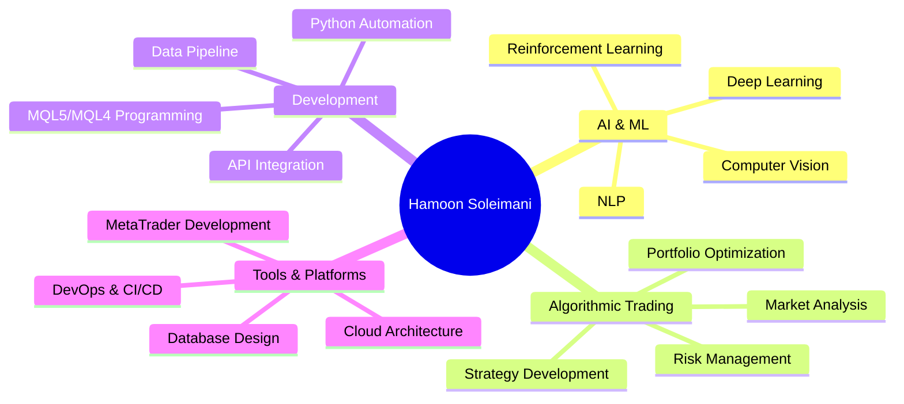

# 👋 Hi there, I'm Hamoon Soleimani

  
  
  
  **A Passionate Developer, AI Enthusiast, and Algorithmic Trader**
  
  
  
  
  

---

## 🌟 About Me

I am a **results-driven developer** with a deep passion for the intersection of **Artificial Intelligence** and **Financial Markets**. My journey is fueled by a desire to build intelligent, automated systems that solve complex problems and drive innovation in the FinTech space.

### 🎯 Current Focus
- 🧠 **Core Expertise:** Building and optimizing trading algorithms using `Python`, `MQL5`, and `MQL4`
- 🔭 **Currently Working On:** Developing sophisticated AI-driven trading bots and real-time data analysis tools
- 🌱 **Currently Learning:** Advanced Reinforcement Learning for financial applications and quantum computing concepts
- 🤝 **Looking to Collaborate:** On open-source AI/ML projects and algorithmic trading solutions
- 💬 **Ask Me About:** `Python`, `AI/ML`, `Algorithmic Trading`, `MQL5`, `Data Scraping`, `Automation`, and `Financial Markets`
- 📫 **How to Reach Me:** Feel free to connect with me on any platform below!
- ⚡ **Fun Fact:** I believe the best code is not just functional, but also elegant and simple

 

---

## 🛠️ Technology Stack

### 💻 Programming Languages

### 🧠 AI & Data Science

### 🔧 Tools & Platforms

---

## 📊 GitHub Analytics

  
  
  
  

  
  
  

  
  
  

---

## 🚀 Featured Projects

| 🏆 Project | 📝 Description | 🛠️ Tech Stack | ⭐ Stars | 🔗 Links |
|------------|-----------------|----------------|----------|----------|
| **[Pr0xySh4rk](https://github.com/HamoonSoleimani/Pr0xySh4rk)** | 🦈 Advanced proxy management tool that merges, tests, and streamlines v2ray proxy subscriptions for faster, reliable connections |  |  |  |
| **[ForexDashboard](https://github.com/HamoonSoleimani/ForexDashboard)** | 📈 Sophisticated Forex Trading Robot with real-time multi-source data analysis and automated decision-making capabilities |   |  |  |
| **[Mises-Wire-Epub](https://github.com/HamoonSoleimani/Mises-Wire-Epub)** | 📚 Intelligent content converter that transforms Mises Wire articles into beautifully formatted EPUB books with metadata extraction |  |  |  |
| **[ML-Portfolio-with-PF](https://github.com/HamoonSoleimani/ML-Portfolio-with-PF)** | 🤖 Advanced Machine Learning Portfolio optimization using Profit Factor metrics for algorithmic trading strategies |   |  |  |
| **[Squeeze Momentum Indicator](https://github.com/HamoonSoleimani/Squeeze-Momentum-indicator-lazybear-)** | 📊 Professional MQL5 implementation of LazyBear's popular Squeeze Momentum Indicator with enhanced features |  |  |  |
| **[WilliamsVIXfix](https://github.com/HamoonSoleimani/WilliamsVIXfix)** | 📈 MetaTrader 5 implementation of Williams VIX Fix synthetic volatility indicator for market analysis |  |  |  |

---

## 📈 Contribution Activity

  <picture>
    <source 
      media="(prefers-color-scheme: dark)" 
      srcset="https://raw.githubusercontent.com/HamoonSoleimani/HamoonSoleimani/output/github-snake-dark.svg?v=1" 
    />
    <source 
      media="(prefers-color-scheme: light)" 
      srcset="https://raw.githubusercontent.com/HamoonSoleimani/HamoonSoleimani/output/github-snake.svg?v=1" 
    />
    
  </picture>

---

## 🎯 Expertise Areas

---

## 🏆 GitHub Achievements

---

## 📚 Learning Path & Goals

### 🎯 2024 Objectives
- [ ] 🚀 Master Advanced Reinforcement Learning for Trading
- [ ] 🔬 Dive Deep into Quantum Computing Applications
- [ ] 🌐 Build Scalable Microservices Architecture
- [ ] 📊 Develop Real-time Analytics Dashboard
- [ ] 🤖 Create AI-Powered Trading Assistant
- [ ] 📖 Contribute to Open-Source ML Libraries

### 🔬 Research Interests
- **Quantitative Finance:** Advanced mathematical models for market prediction
- **Machine Learning:** Novel approaches to time-series forecasting
- **Artificial Intelligence:** Autonomous trading system development
- **Data Science:** Big data analytics for financial markets

---

## 💡 Code Philosophy

> *"The best way to predict the future is to code it."*

🎨 <b>My Development Principles</b>

 

- **🎯 Purpose-Driven:** Every line of code should serve a clear purpose
- **🧹 Clean & Readable:** Write code that tells a story
- **⚡ Performance-Focused:** Optimize for speed and efficiency
- **🔒 Security-First:** Build with security considerations from day one
- **🧪 Test-Driven:** Comprehensive testing ensures reliability
- **🔄 Iterative:** Continuous improvement and refactoring
- **📚 Documentation:** Well-documented code is maintainable code
- **🤝 Collaborative:** Code should be easy for teams to work with

---

## 🌐 Connect With Me

### 💬 Let's Talk About
- 🤖 **AI & Machine Learning** innovations and applications
- 📈 **Algorithmic Trading** strategies and implementations  
- 🐍 **Python** development and best practices
- 🔄 **Open Source** collaboration opportunities
- 💡 **Tech Trends** and emerging technologies
- 🚀 **Career Development** in tech and finance

---

### 📊 Visitor Count

### 🎨 Profile Credits
*This README was crafted with ❤️ using modern GitHub profile techniques*

---

**"Innovation distinguishes between a leader and a follower."** - *Steve Jobs*

⚡ *Ready to build the future of finance with AI? Let's connect and create something amazing together!*

